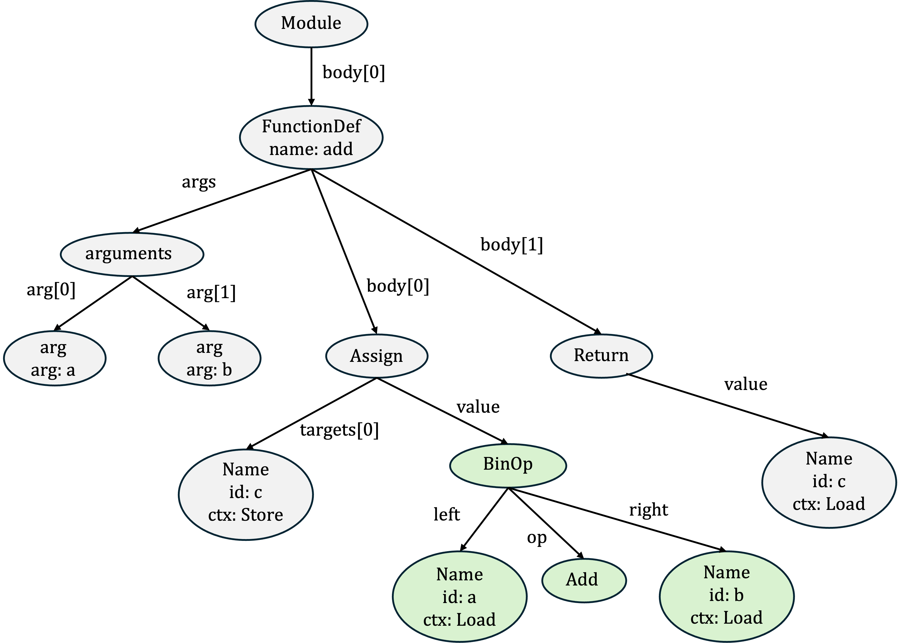

# COMP3021 Spring 2024 Java Programming Assignment 1 (PA1)

## Python AST Management System

**[AST (Abstract Syntax Tree)](https://en.wikipedia.org/wiki/Abstract_syntax_tree)** is a tree representation that represents the syntactic structure of source code. It is widely used in compilers and interpreters to reason about relationships between program elements. In this project, you are required to implement your own management system, named **ASTManager**, for parsing and analyzing Python ASTs.

### Grading System

 In PA1, **ASTManager** should support the following functionalities:

- Task 1: Parse the XML files that organize the tree structure of Python ASTs (40%)
- Task 2: Simple query on basic information of given ASTs (5 * 10% = 50%)
- Task 3: Sort all functions based on their lines of code (LoC) (10%)
- Bonus Task: Recover the Python code from its AST (10%)

Each test case is an XML file that represents a Python AST. We provide public test cases for you to verify the correctness of your implementations. However, passing all the public test cases does not mean that you can obtain the full mark for the PA. We will also provide many additional test cases as the hidden ones, which are different from the ones we provided in the skeleton.

Before task specification, we first explain the grading policy as follows for your reference so that you will not miss it.

| Item                                                      | Ratio | Notes                                                        |
| --------------------------------------------------------- | ----- | ------------------------------------------------------------ |
| Keeping your GitHub repository private                    | 5%    | You must keep your repository **priavte** at all times.      |
| Having at least three commits on different days           | 5%    | You should commit three times during different days in your repository |
| Code style                                                | 10%   | You get 10% by default, and every 5 warnings from CheckStyle deducts 1%. |
| Public test cases (Task 1 + Task 2 + Task 3 + Bonus Task) | 30%   | (# of passing tests / # of provided tests) * 30%             |
| Hidden test cases (Task 1 + Task 2 + Task 3 + Bonus Task) | 50%   | (# of passing tests / # of provided tests) * 50%             |

### Python ASTs 

We now provide essential background about Python AST for you. The AST captures the essential elements of programs' syntax. Specifically, each node in AST denotes a specific program element in source code, such as operators, functions, statements, and expressions. Taking the following simple Python code as an instance, the function `add` computes the sum of two arguments `a` and `b`. The results are stored in variable `c` and returned as the return value.

```python
def add(a, b):
    c = a + b
    return c
```

The AST of the Python code is shown below. Each AST node has a defined structure, consisting of **node type**, **attributes**, and **child nodes**. 



For instance, `FunctionDef` is the node type, and its attribute `name` is `add`. Such node has three child nodes, which are the arguments and body of function `add`, i.e., `arguments`, `Assign`, and `Return`. Note that the node attributes are optional and vary based on the node type. For instance, the attributes of node type `Name` are `id` and `ctx`, which represent the corresponding variable name and whether the variable is read or written. We can notice that the nodes in green essentially represent the addition operation of two variables `a` and `b` in the second line of Python code.

The above example only shows sampled program elements in Python. Please refer to the Abstract Grammar section of this [document](https://docs.python.org/3/library/ast.html) to access the complete ASDL (Abstract Syntax Description Language) for all node types in Python. Let's explain the following grammar of `BinOp` as an example. 

```python
expr = ...
       | BinOp(expr left, operator op, expr right)
       ...
       | Name(identifier id, expr_context ctx)
      
expr_context = Load | Store | Del
operator     = Add | Sub | Mult | MatMult | Div | Mod | Pow | LShift
                   | RShift | BitOr | BitXor | BitAnd | FloorDiv
```

The above grammar for `BinOp` node indicates:

- `BinOp` is a binary expression with two operands and one operator.
- `BinOp` has two fields, `left` and `right`, which are the left and right operands of binary expression. These two fields are expressions as well, which could be binary expressions or other expression types. 
- If the operands of binary expression is a variable, the node type would be `Name`, whose field `id` represents the variable name and `ctx` marks whether the value of the variable is read or written. For instance, `Load` means the value of the variable is read here. 
- `BinOp` has a field, `op`, which is the operator of the binary expression. The operator could be `Add`, `Sub`, etc.

In PA1, you need to implement the classes of nodes defined in the grammar. In the following, we provide more concrete specifications for related classes, their fields, and methods in the provided skeleton.

### Classes

Based on the AST grammar, there are three basic classes in PA1: `Mod`, `Stmt`, and `Expr`, which represent modules, statements, and expressions. Other node types are almost the subclasses of these three basic classes.

`Mod` base class represents the root nodes of ASTs. Each AST corresponds to a Python source file. `Mod` has one field, i.e., `file_path: String`, which is the file path of the original Python source file. `Stmt` and `Expr` base classes have four fields as follows:

- `lineno: int`: the first line number of elements in code
- `col_offset: int`: the UTF-8 byte offset of the first token of the element in code
- `end_lineno: int`: the end line number of the element in the code
- `end_col_offset: int`: the UTF-8 byte offset of the last token of the element in code

 You should set both of them to be private and implement the methods to get or set their values.

The ASTs being managed are obtained by parsing files. Therefore, you should first implement a proper constructor that takes a string as input.  You may need to define more methods according to your needs during the development.

#### Mod Subclasses

The class `Mod` has four subclasses, namely `ModuleMod`, `InteractiveMod`, `ExpressionMod`, and `FunctionTypeMod`.  These classes are root nodes of ASTs.

```
  mod = Module(stmt* body, type_ignore* type_ignores)
      | Interactive(stmt* body)
      | Expression(expr body)
      | FunctionType(expr* argtypes, expr returns)
```

According to the above AST grammar, we outline the fields of these four subclasses except for the `file_path` field as follows:

- The class `ModuleMod` has two fields, i.e., lists of statements `body: ArrayList<Stmt>` and lists of type ignore comments `type_ignores: ArrayList<TypeIgnore>`. 
- The class `InteractiveMod` has one field, i.e., a list of statements `body: ArrayList<Stmt>`.
- The class `ExpressionMod` has one field, i.e., a single expression `body: Expr`.

- The class `FunctionTypeMod` has two fields, i.e., a list of expressions `argtypes: ArrayList<Expr>` and a single return expression `returns: Expr`.

All fields of these classes should be private. You need to implement these four classes as the subclasses of `Mod`. Specifically, you should implement their constructors according to your needs. Besides, you may need to define more methods according to your needs during the development, such as `getter` or `setter` to access private fields.

#### Stmt SubClasses

The class `Stmt` has 28 subclasses according to the corresponding AST grammar.

```
stmt = FunctionDef(identifier name, arguments args,
                       stmt* body, expr* decorator_list, expr? returns,
                       string? type_comment, type_param* type_params)
          ...
          | Assign(expr* targets, expr value, string? type_comment)
          ...

```

We outline the fields of two of them as examples.

- The class `FunctionDefStmt` has 6 fields:
  -  `name: String`: function name 
  -  `args: ArrayList<Arguments>`: function arguments
  -  `body: ArrayList<Stmt>`: function body, which is a list of statements
  -  `decorator_list: ArrayList<Expr>`: a list of decorators
  -  `returns: Expr`: return annotation
  -  `type_comment: String`: type annotation comments
  -  `type_params: ArrayList<TypeParam>`: a list of type parameters

- The class `Assign` has three fields, i.e., `targets: ArrayList<Expr>`, `value: Expr`, and `type_comment: String`.

Similarly, all fields of these classes should be private. You need to implement these 28 classes as the subclasses of `Stmt`. 

To convenience your implementation, we have provided the skeleton of these 28 classes. For more detailed explanation of fields and methods, you can refer to the class files under the directory `src/main/java/hk.ust.comp3021/statements`.

#### Expr SubClasses

The class `Expr` has 27 subclasses. We outline the fields of three of them as examples.

```
 expr = BoolOp(boolop op, expr* values)
         ...
         | BinOp(expr left, operator op, expr right)
         ...
         | Name(identifier id, expr_context ctx)
         ...
```

- The class `BoolOpExpr` has two fields, i.e., boolean operator `op: BoolOp` and a list of expressions `values: ArrayList<Expr>`.
- The class `BinOpExpr` has three fields, i.e., binary operator `op: Operator`, left operand expression `left: Expr`, and right operand expression `right: Expr`.
- The class `NameExpr` has two fields, i.e., variable name `id: String` and `crx: ExprCtx`.

You can refer to the class files under the directory `src/main/java/hk.ust.comp3021/expressions` for more detail. Similar to `Stmt` and its subclasses, you need to implement these 27 subclasses to support the desired functionality.

#### Other Classes or Types

Several types haven't been introduced but are used when implementing the above subclasses. Please implement them according to the AST grammar. 

```
expr_context = Load | Store | Del
keyword = (identifier? arg, expr value)
               attributes (int lineno, int col_offset, int? end_lineno, int? end_col_offset)
```

For instance, you can implement `ExprCtx` as an enum type and `Keyword` as a class containing six fields, i.e., `arg: String`, `value: Expr`, `lineno: int`, `col_offset: int`, `end_lineno: int` and `end_col_offset: int`.

### Utils

To support AST parsing, managing, and analyzing, you are also required to define two classes as follows:

#### ASTParser

We provide Python ASTs in XML files. Each XML file corresponds to an object in `Mod` class. 

`ASTParser` parses a given XML file that organizes the AST tree structure and extracts corresponding objects. If the parsing succeeds, you should set `isErr` to `false`. Otherwise, it should be set to `true`. An example of the XML file is `resources/xmldata/PAData.xml`. 

We use the following XML snippet for the green nodes in the aforementioned AST example to explain the XML format.

```xml
<BinOp lineno="2" col_offset="8" end_lineno="2" end_col_offset="13">
  <Name id="a" lineno="2" col_offset="8" end_lineno="2" end_col_offset="9">
    <Load/>
  </Name>
  <Add/>
  <Name id="b" lineno="2" col_offset="12" end_lineno="2" end_col_offset="13">
    <Load/>
  </Name>
</BinOp>
```

- **Elements:** The basic building blocks of XML document are elements, which consist of start tags, contents, and end tags. For instance, `Name` element starts with the tag `<Name>` and ends with `<\Name>`. Alternatively, the tag can be self-closing, such as `<Load/>`, indicating the element does not contain any content and child elements. 
- **Attributes:** Elements can have attributes, which provide additional information about elements. Attributes are defined within the start tag. For instance, `<Name id="c" lineno="2" col_offset="4" end_lineno="2" end_col_offset="5">` indicates the `id` field of the `Name` element is `c`. 
- **Hierarchy**: Elements in XML documents are nested within each other to form a tree structure. The tree structures of the above XML snippet are shown below, which is consistent with the green nodes in the aforementioned AST.

```
BinOp (attributes: lineno="2", col_offset="8", end_lineno="2", end_col_offset="13")
├── Name (attributes: id="a", lineno="2", col_offset="8", end_lineno="2", end_col_offset="9")
│   └── Load
├── Add
└── Name (attributes: id="b", lineno="2", col_offset="12", end_lineno="2", end_col_offset="13")
    └── Load
```

When you parse the file, you can assume that all the XML files in our test cases are legal. Note that you are not allowed to invoke library functions to parse XML files directly.

#### ASTUnparser (Bouns Task)

`ASTUnparser` unparses a tree structure of AST back to its original Python code. For instance, after you parsing the XML file that represents the AST shown in the above example, the `ASTUnparser` takes charge of generating the original Python code as follows.

```python
def add(a, b):
    c = a + b
    return c
```

**Hints.** Essentially, you can regard the unparsing process as a customized preorder tree traversal. During tree traversal, starting from the root node, you can examine each node in the AST and generate corresponding Python code based on its type and attributes. For instance, if you encounter a `FunctionDef` node with an attribute `name` to be `add`, the generated Python code is `def add(...)`.

Let's go through the preorder traversal of the aforementioned AST example to help you understand the unparsing process. The traversal sequence and code generation process are shown as follows.

```
Module -> FunctionDef (name: add)                           =>  def add(...):
       -> arguments -> arg (arg: a) 
                    -> arg (arg: b)                         =>  def add(a, b):
       -> Assign -> Name (id: c, ctx: Store)                =>      c = ...
                 -> BinOp -> Name (id: a, ctx: Load)    
                          -> Add
                          -> Name (id: b, ctx: Load)        =>      c = a + b
       -> Return -> Name (id: c, ctx: Load)                 =>      return c
       
```

The code generating process involves handling different node types and their attributes. Each node type has specific attributes that need to be considered. I listed the attributes of interests of each node type and what their corresponding codes look like in `reconstruction.md` for your reference. Noticed that Python code is sensitive to indentation, which determines the scope of statements within a block. Please carefully handle the indentation and follow the rules to ensure the reconstructed code is legal and readable.  

### ASTManager and ASTManagerEngine

The class `ASTManager` is the main class of our system, which wraps an `ASTManagerEngine` inside. We provide the major workflow of `ASTManager` shown below in the skeleton:

1. Initially, the system loads all the XML files in the default XML files directory, which depends on the `ASTParser` you implemented. 
2. Later, all the ASTs should be stored in the Tables you designed instead of managed in Memory.
3. Finally, method `userInterface` processes the following analysis commands from the console and invokes corresponding handlers.
   - Given a number N, find all functions whose argument numbers are larger than N.
   - Find the most common operators used in code.
   - Given a function name, find all functions it invokes in the code.
   - Identify all class declarations and their associated methods in the code.
   - Count the number of all node types in the code.
   - Sort all functions based on their lines of code (LoC).
   - Bonus Task: recover the Python Code from its AST.

### What YOU need to do

- Fully define the class `Mod` and its subclasses, including their constructors and other necessary methods.
- Fully define the class `Stmt` and its subclasses, including their constructors and other necessary methods.
- Fully define the class `Expr` and its subclasses, including their constructors and other necessary methods.
- Fully implement `ASTParser` and `ASTUnparser` (optional).
- Fully implement the methods in the class `ASTManageEngine`.

Please follow the comments on the methods to be implemented in the provided skeleton. We have provided detailed descriptions and even several hints for these methods. To convenience the testing and debugging, you can just run the `main` method of `ASTManager` to interact with the system.

### Submission Policy

Please submit your code on Canvas before the deadline **March 23, 2024, 23:59:59.** You should submit a single text file specified as follows:

- A file named `<itsc-id>.txt` containing the URL of your private repository at the first line. We will ask you to add the TAs' accounts as collaborators near the deadline.

For example, a student CHAN, Tai Man with ITSC ID `tmchanaa` having a repository at `https://github.com/tai-man-chan/COMP3021-PA1` should submit a file named `tmchanaa.txt` with the following content:

```txt
https://github.com/tai-man-chan/COMP3021-PA1
```

Note that we are using automatic scripts to process your submission on test cases rather than testing via the console manually. **DO NOT add extra explanation** to the file; otherwise, they will prevent our scripts from correctly processing your submission. 

**We will grade your submission based on the latest committed version before the deadline.** Please make sure all the amendments are made before the deadline and do not make changes after the deadline.

We have pre-configured a gradle task to check style for you. You can run `./gradlew checkstyleMain` in the integrated terminal of IntelliJ to check style.

Before submission, please make sure that: 

1. Your code can be complied with successfully. Please try to compile your code with `./gradlew build` before submission. You will not get any marks for public/hidden test cases if your code cannot be successfully compiled.

2. Your implementation can pass the public test cases we provided in `src/test`.

3. Your implementation should not yield too many errors when running `./gradlew checkstyleMain`.

### Academic Integrity

We trust that you are familiar with the Honor Code of HKUST. If not, refer to [this page](https://course.cse.ust.hk/comp3021/#policy).

### Contact US

If you have any questions on the PA1, please email TA Wei Chen via wei.chen@connect.ust.hk

---

Last Update: Feb 24, 2024